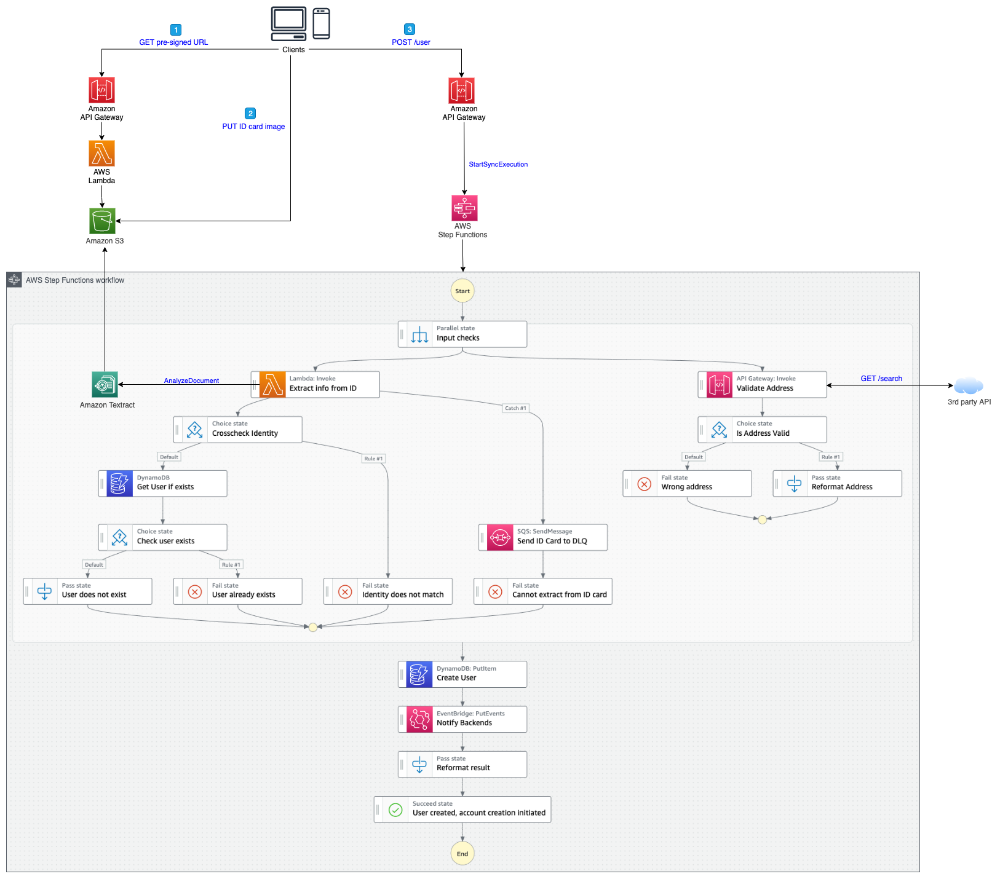

# Direct Integration

This sub-project is an improvment of a naive approach that consists in using Lambda functions to perform all the operations. In this case, we leverage direct integrations with Step Functions and API Gateway. The following diagram describes the architecture:

This [blog post]() explains why and how to improve a [Lambda-based architecture](../lambda-integration/) to optimize performance, cost and resilience.

## How to test
The project is divided in two parts:
 * **Infra**: infrastructure as code defined with AWS Cloud Development Kit (CDK)
    * `npm install` to install all dependencies
    * `npm run build`   compile typescript to js
    * `npm run watch`   watch for changes and compile
    * `make deploy`(*)      deploy this stack to your default AWS account/region
    * `cdk synth`       emits the synthesized CloudFormation template
 * **Front**: a simple React web application.
   * `npm install` to install all dependencies
   * Update the backend API url in _App.js_ with the one in the output of the infra stack.
   * `npm run start` to locally test the application (http://localhost:3000)

(*) This version also contains a [Mocked Service Integration configuration](https://docs.aws.amazon.com/step-functions/latest/dg/sfn-local-test-sm-exec.html), so that you can perform local tests of the Step Functions state machine without reaching the cloud. To do so you can use the makefile (Docker is also required):
 * `make run-sfn-local` to start [Step Functions local](https://docs.aws.amazon.com/step-functions/latest/dg/sfn-local-docker.html)
 * `make deploy` to perform the cdk deploy and retrieve the state machine definition in json format
 * `make create` to create the state machine locally
 * `make tests` or `npm run test` to perform the jest unit tests