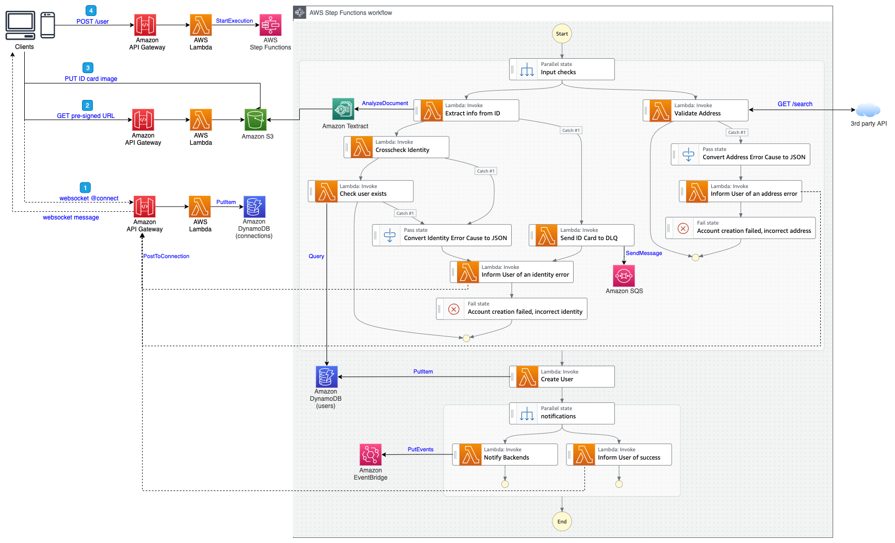

# Lambda Integration

This sub-project is a "naive" but working example using Step Functions and Lambda functions to perform the operations. The following diagram describes the architecture:

This [blog post]() explains why and how to improve this architecture by leveraging direct integrations with Step Functions and API Gateway. Source code of the improved architecture is [here](../direct-integration/).

## How to test
The project is divided in two parts:
 * **Infra**: infrastructure as code defined with AWS Cloud Development Kit (CDK)
    * `npm install` to install all dependencies
    * `npm run build`   compile typescript to js
    * `npm run watch`   watch for changes and compile
    * `npm run test`    perform the jest unit tests
    * `cdk deploy`      deploy this stack to your default AWS account/region
    * `cdk synth`       emits the synthesized CloudFormation template
 * **Front**: a simple React web application.
   * `npm install` to install all dependencies
   * Update the backend API url in _App.js_ with the one in the output of the infra stack.
   * `npm run start` to locally test the application (http://localhost:3000)